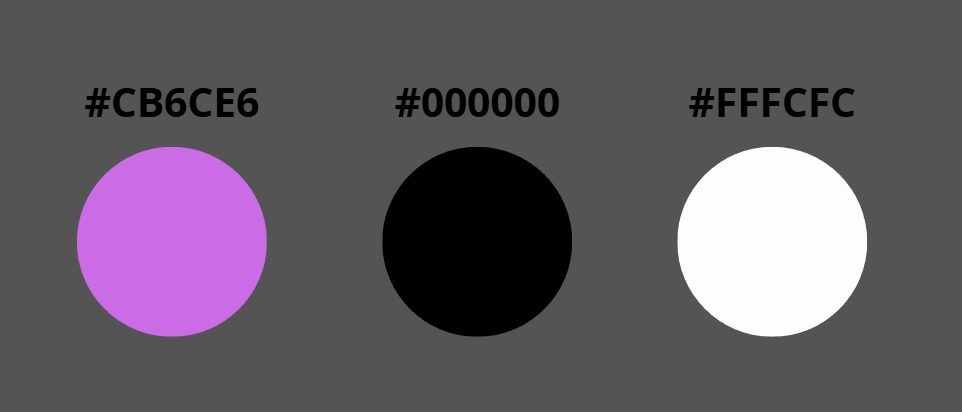

 
  
## Universidad Peruana de Ciencias Aplicadas

## TB1 "StayMap"

**1ASI0730  -  Aplicaciones Web**

Carrera de Ingeniería de Software

**NRC:** 4376

**Profesor:** Hugo Allan Mori Paiva

**Integrantes:**

Collantes Carrillo, Diego Mateo (u202311823)

Lizarbe Alvarez, Ariana Nickole (u202311704)

Ortiz Cardenas, Johanna Antuanete (u202310358)

Zegarra Lopez, Renato Sebastian Rubber (u202311558)

Zúñiga Murillo, Diego Sebastian (u202310636)

**2025**

## Registro de Versiones del Informe

<table>
  <thead>
    <tr>
      <th>Versión</th>
      <th>Fecha</th>
      <th>Autor</th>
      <th>Descripción de modificación</th>
    </tr>
  </thead>
  <tbody>
    <tr>
      <td>TB1</td>
      <td>27/04/2025</td>
      <td>
	- Collantes Carrillo, Diego Mateo  
	- Lizarbe Alvarez, Ariana Nickole  
	- Ortiz Cardenas, Johanna Antuanete  
	- Zegarra Lopez, Renato Sebastian Rubber   
	- Zúñiga Murillo, Diego Sebastian  
      </td>
      <td></td>
    </tr>
    <tr>
      <td>TP</td>
      <td></td>
      <td></td>
      <td></td>
    </tr>
    <tr>
      <td>TB2</td>
      <td></td>
      <td></td>
      <td></td>
    </tr>
    <tr>
      <td>TF</td>
      <td></td>
      <td></td>
      <td></td>
    </tr>
  </tbody>
</table>

## Contents

- [STUDENT OUTCOME](#student-outcome)
- [Project Report Collaboration Insights](#project-report-collaboration-insights)

- [CAPÍTULO I: INTRODUCCIÓN](#capítulo-i-introducción)
  - [1.1. Startup Profile](#11-startup-profile)
    - [1.1.1. Descripción de la Startup](#111-descripción-de-la-startup)
    - [1.1.2. Perfiles de integrantes del equipo](#112-perfiles-de-integrantes-del-equipo)
  - [1.2. Solution Profile](#12-solution-profile)
    - [1.2.1. Antecedentes y problemática](#121-antecedentes-y-problemática)
    - [1.2.2. Lean UX Process](#122-lean-ux-process)
      - [1.2.2.1. Lean UX Problem Statements](#1221-lean-ux-problem-statements)
      - [1.2.2.2. Lean UX Assumptions](#1222-lean-ux-assumptions)
      - [1.2.2.3. Lean UX Hypothesis Statements](#1223-lean-ux-hypothesis-statements)
      - [1.2.2.4. Lean UX Canvas](#1224-lean-ux-canvas)
  - [1.3. Segmentos objetivo](#13-segmentos-objetivo)

- [Capítulo II: Requirements Elicitation & Analysis](#capítulo-ii-requirements-elicitation--analysis)
  - [2.1. Competidores](#21-competidores)
    - [2.1.1. Análisis competitivo](#211-análisis-competitivo)
    - [2.1.2. Estrategias y tácticas frente a competidores](#212-estrategias-y-tácticas-frente-a-competidores)
  - [2.2. Entrevistas](#22-entrevistas)
    - [2.2.1. Diseño de entrevistas](#221-diseño-de-entrevistas)
    - [2.2.2. Registro de entrevistas](#222-registro-de-entrevistas)
    - [2.2.3. Análisis de entrevistas](#223-análisis-de-entrevistas)
  - [2.3. Needfinding](#23-needfinding)
    - [2.3.1. User Personas](#231-user-personas)
    - [2.3.2. User Task Matrix](#232-user-task-matrix)
    - [2.3.3. User Journey Mapping](#233-user-journey-mapping)
    - [2.3.4. Empathy Mapping](#234-empathy-mapping)
    - [2.3.5. As-is Scenario Mapping](#235-as-is-scenario-mapping)
  - [2.4. Ubiquitous Language](#24-ubiquitous-language)

- [Capítulo III: Requirements Specification](#capítulo-iii-requirements-specification)
  - [3.1. To-Be Scenario Mapping](#31-to-be-scenario-mapping)
  - [3.2. User Stories](#32-user-stories)
  - [3.3. Impact Mapping](#33-impact-mapping)
  - [3.4. Product Backlog](#34-product-backlog)

- [Capítulo IV: Product Design](#capítulo-iv-product-design)
  - [4.1. Style Guidelines](#41-style-guidelines)
    - [4.1.1. General Style Guidelines](#411-general-style-guidelines)
    - [4.1.2. Web Style Guidelines](#412-web-style-guidelines)
  - [4.2. Information Architecture](#42-information-architecture)
    - [4.2.1. Organization Systems](#421-organization-systems)
    - [4.2.2. Labeling Systems](#422-labeling-systems)
    - [4.2.3. SEO Tags and Meta Tags](#423-seo-tags-and-meta-tags)
    - [4.2.4. Searching Systems](#424-searching-systems)
    - [4.2.5. Navigation Systems](#425-navigation-systems)
  - [4.3. Landing Page UI Design](#43-landing-page-ui-design)
    - [4.3.1. Landing Page Wireframe](#431-landing-page-wireframe)
    - [4.3.2. Landing Page Mock-up](#432-landing-page-mock-up)
  - [4.4. Web Applications UX/UI Design](#44-web-applications-uxui-design)
    - [4.4.1. Web Applications Wireframes](#441-web-applications-wireframes)
    - [4.4.2. Web Applications Wireflow Diagrams](#442-web-applications-wireflow-diagrams)
    - [4.4.3. Web Applications Mock-ups](#443-web-applications-mock-ups)
    - [4.4.4. Web Applications User Flow Diagrams](#444-web-applications-user-flow-diagrams)
  - [4.5. Web Applications Prototyping](#45-web-applications-prototyping)
  - [4.6. Domain-Driven Software Architecture](#46-domain-driven-software-architecture)
    - [4.6.1. Software Architecture Context Diagram](#461-software-architecture-context-diagram)
    - [4.6.2. Software Architecture Container Diagrams](#462-software-architecture-container-diagrams)
    - [4.6.3. Software Architecture Components Diagrams](#463-software-architecture-components-diagrams)
  - [4.7. Software Object-Oriented Design](#47-software-object-oriented-design)
    - [4.7.1. Class Diagrams](#471-class-diagrams)
    - [4.7.2. Class Dictionary](#472-class-dictionary)
  - [4.8. Database Design](#48-database-design)
    - [4.8.1. Database Diagram](#481-database-diagram)

- [Capítulo V: Product Implementation, Validation & Deployment](#capítulo-v-product-implementation-validation--deployment)
  - [5.1. Software Configuration Management](#51-software-configuration-management)
    - [5.1.1. Software Development Environment Configuration](#511-software-development-environment-configuration)
    - [5.1.2. Source Code Management](#512-source-code-management)
    - [5.1.3. Source Code Style Guide & Conventions](#513-source-code-style-guide--conventions)
    - [5.1.4. Software Deployment Configuration](#514-software-deployment-configuration)
  - [5.2. Landing Page, Services & Applications Implementation](#52-landing-page-services--applications-implementation)
    - [5.2.1. Sprint 1](#521-sprint-1)
      	- [5.2.1.1. Sprint Planning 1](#5211-sprint-planning-1)
	- [5.2.1.2. Aspect Leaders and Collaborators](#5212-aspect-leaders-and-collaborators)
	- [5.2.1.3. Sprint Backlog 1](#5213-sprint-backlog-1)
	- [5.2.1.4. Development Evidence for Sprint Review](#5214-development-evidence-for-sprint-review)
	- [5.2.1.5. Execution Evidence for Sprint Review](#5215-execution-evidence-for-sprint-review)
	- [5.2.1.6. Software Deployment Evidence for Sprint Review](#5216-software-deployment-evidence-for-sprint-review)
	- [5.2.1.7. Team Collaboration Insights during Sprint](#5217-team-collaboration-insights-during-sprint)
- [Conclusiones](#conclusiones)
- [Bibliografía](#bibliografía)
- [Anexos](#anexos)

## STUDENT OUTCOME
ABET - EAC - Student Outcome 3: Capacidad de comunicarse efectivamente con un rango de audiencias. En el siguiente cuadro se describen las acciones realizadas y enunciados de conclusiones por parte del grupo, que permiten sustentar el haber alcanzado el logro.

<table border="1">
  <thead>
    <tr>
      <th>Criterio específico</th>
      <th>Acciones realizadas</th>
      <th>Conclusiones</th>
    </tr>
  </thead>
  <tbody>
    <tr>
      <td>Comunica oralmente con efectividad a diferentes rangos de audiencia</td>
      <td>
        <strong>Collantes Carrillo, Diego Mateo</strong> 
        TB1: Como parte del equipo de STAYMAP, me encargué de diseñar los diagramas C4 y UML para representar la arquitectura del sistema. Presenté estos diagramas al equipo y a los stakeholders, explicando su estructura y cómo cada componente se integra en el proyecto. 
        <strong>Lizarbe Alvarez, Ariana Nickole</strong> 
        TB1: Desarrollé la Landing Page de STAYMAP, como modelo inicial en figma, enfocándome en un diseño atractivo y funcional. Mi objetivo fue comunicar claramente el propósito de la plataforma a los usuarios potenciales y recoger sus primeras impresiones. 
        <strong>Ortiz Cardenas, Johanna Antuanete</strong> 
        TB1: Elaboré el Modelo C4 y diagrama de clases UML de STAYMAP, detallando los niveles de abstracción del sistema. Mi contribución ayudó a que tanto el equipo técnico como los clientes entendieran la escalabilidad y las conexiones entre módulos. 
        <strong>Zegarra Lopez, Renato Sebastian Rubber</strong> 
        TB1: Diseñé la base de datos de STAYMAP, definiendo las tablas, relaciones y consultas principales. Mi trabajo aseguró que los datos se almacenaran de manera eficiente y estuvieran listos para su implementación. 
        <strong>Zúñiga Murillo, Diego Sebastián</strong> 
        TB1: Realicé los análisis de entrevistas con usuarios potenciales de STAYMAP y señalé sus necesidades. Registré y comuniqué los hallazgos al equipo para que el desarrollo se alineara con las expectativas del público objetivo.
      </td>
      <td>
        <strong>Collantes Carrillo, Diego Mateo</strong> 
        TB1: Los diagramas que creé facilitaron la comunicación técnica dentro del equipo y con los stakeholders, evitando malentendidos en las fases iniciales de STAYMAP. 
        <strong>Lizarbe Alvarez, Ariana Nickole</strong> 
        TB1: La Landing Page que desarrollé no solo presentó STAYMAP de manera profesional, sino que también nos permitió validar el interés de los usuarios antes del lanzamiento. 
        <strong>Ortiz Cardenas, Johanna Antuanete</strong> 
        TB1: El Modelo C4 que elaboré se convirtió en una herramienta clave para explicar la complejidad técnica de STAYMAP de manera accesible, incluso para perfiles no técnicos. 
        <strong>Zegarra Lopez, Renato Sebastian Rubber</strong> 
        TB1: El diseño de la base de datos que propuse optimizó el rendimiento de STAYMAP, sentando las bases para un sistema escalable y confiable. 
        <strong>Zúñiga Murillo, Diego Sebastian</strong> 
        TB1: Las entrevistas que conduje revelaron insights valiosos, permitiendo que STAYMAP priorizara funciones clave como la personalización de búsquedas y la confiabilidad de las reseñas.
      </td>
    </tr>
    <tr>
      <td>Comunica por escrito con efectividad a diferentes rangos de audiencia</td>
      <td>
        <strong>Collantes Carrillo, Diego Mateo</strong> 
        TB1: Lideré la creación de documentos técnicos especializados para STAYMAP, transformando complejos diagramas arquitectónicos en guías accesibles con versiones para equipos de desarrollo (detalle técnico) y stakeholders (enfoque ejecutivo). 
        <strong>Lizarbe Alvarez, Ariana Nickole</strong> 
        TB1: Diseñé la estrategia de contenido multiplataforma para STAYMAP, desarrollando desde whitepapers técnicos hasta copywriting persuasivo para la Landing Page, ajustando registro y profundidad según cada canal. 
        <strong>Ortiz Cardenas, Johanna Antuanete</strong> 
        TB1: Estructuré el sistema de documentación modular de STAYMAP, creando plantillas estandarizadas para reportes técnicos que permitieron escalar la comunicación del proyecto sin perder consistencia. 
        <strong>Zegarra Lopez, Renato Sebastian Rubber</strong> 
        TB1: Publiqué artículos técnicos en el blog interno de STAYMAP explicando patrones de diseño de bases de datos, estableciéndome como referente para consultas escritas del equipo. 
        <strong>Zúñiga Murillo, Diego Sebastian</strong> 
        TB1: Implementé un sistema de síntesis de feedback con dashboards escritos automatizados para STAYMAP, transformando datos cualitativos en informes ejecutivos mensuales.
      </td>
      <td>
        <strong>Collantes Carrillo, Diego Mateo</strong> 
        TB1: La documentación que preparé se convirtió en la referencia principal para el equipo técnico, asegurando una correcta implementación de los diagramas en STAYMAP. 
        <strong>Lizarbe Alvarez, Ariana Nickole</strong> 
        TB1: Los textos que desarrollé comunicaron efectivamente el propósito de STAYMAP, recibiendo comentarios positivos tanto de usuarios como del equipo interno. 
        <strong>Ortiz Cardenas, Johanna Antuanete</strong> 
        TB1: Las guías que escribí permitieron que nuevos integrantes del equipo pudieran entender rápidamente el Modelo C4 y su aplicación en STAYMAP. 
        <strong>Zegarra Lopez, Renato Sebastian Rubber</strong> 
        TB1: La documentación de la base de datos que elaboré facilitó el trabajo diario del equipo, evitando confusiones en el manejo de la información. 
        <strong>Zúñiga Murillo, Diego Sebastian</strong> 
        TB1: Mis informes organizaron el feedback de los usuarios de manera clara, permitiendo priorizar funciones importantes para STAYMAP.
      </td>
    </tr>
  </tbody>
</table>

# CAPÍTULO II: Requirements Elicitation & Analysis

# 2.1. Competidores

## 2.1.1. Análisis competitivo

<table border="2" style="text-align: center;">
	<tbody>
		<tr >
			<td colspan="6">Competitive Analysis Landscape</td>
		</tr>
		<tr>
			<td colspan="2">¿Por que llevar a cabo este análisis?</td>
			<td colspan="4">Esto es clave para entender cómo otras plataformas están abordando el descubrimiento de eventos musicales, qué características valoran los usuarios y dónde existen oportunidades no cubiertas, especialmente en relación con la promoción de conciertos de pequeña y mediana escala. Al conocer mejor a la competencia, podemos tomar decisiones más informadas sobre funcionalidades, modelo de negocio, diferenciadores clave y estrategias de crecimiento.
            </td>
		</tr>
		<tr>
			<td colspan="2"></td>
			<td>StayMap</td>
			<td>Songkick</td>
			<td>Bandsintown</td>
			<td>Fever</td>
		</tr>
		<tr>
			<td rowspan="2">Perfil</td>
			<td>Overview</td>
			<td>Conecta a los fans con conciertos en vivo a través de un mapa interactivo con geolocalización. Se enfoca en promover la escena musical y fortalecer el vínculo entre artistas y su público local.</td>
			<td>Permite descubrir conciertos de artistas favoritos y recibir alertas personalizadas según ubicación. Se enfoca principalmente en giras de artistas reconocidos.</td>
			<td>Conecta a fans con conciertos mediante recomendaciones basadas en gustos musicales. Incluye herramientas para que artistas promuevan sus eventos.</td>
			<td>Ayuda a descubrir eventos culturales locales, incluyendo conciertos, teatro y experiencias únicas. Su enfoque va más allá de la música en vivo.</td>
		</tr>
		<tr>
			<td>Ventaja competitiva ¿Que valor ofrece a los clientes?</td>
			<td>Facilita el descubrimiento espontáneo de conciertos mediante un mapa interactivo y geolocalizado, acercando a los fans a la música local en tiempo real.</td>
			<td>Ofrece a los usuarios alertas personalizadas sobre conciertos de sus artistas favoritos, permitiendo planificar asistencias con anticipación de forma sencilla.</td>
			<td>Combina recomendaciones personalizadas con herramientas de promoción para artistas, creando un ecosistema donde fans y músicos pueden interactuar directamente.</td>
			<td>Proporciona una experiencia cultural completa con recomendaciones curadas de eventos locales, destacando experiencias exclusivas y originales para cada usuario.</td>
		</tr>
		<tr>
			<td rowspan="2">Perfil de Marketing</td>
			<td>Mercado objetivo</td>
			<td>Personas jóvenes y amantes de la música que buscan descubrir conciertos y conectar con la escena local</td>
			<td>Fans de la música que siguen a artistas reconocidos y desean recibir alertas sobre giras y conciertos en su ciudad o alrededores</td>
			<td>Amantes de la música en general, desde fans de artistas emergentes hasta grandes estrellas, así como músicos que buscan promocionar sus eventos</td>
			<td>Personas urbanas interesadas en actividades culturales y de ocio variadas, que buscan planes originales y experiencias únicas en su ciudad</td>
		</tr>
		<tr>
			<td>Estrategias de marketing</td>
			<td>Se enfoca en el marketing comunitario y uso de redes sociales para promover conciertos en tiempo real y crear comunidad entre fans y artistas.</td>
			<td>Se apoya en integraciones con plataformas de streaming (como Spotify) y recomendaciones personalizadas para captar usuarios. También colabora con artistas reconocidos para promocionar giras y vender entradas.</td>
			<td>Utiliza notificaciones personalizadas, campañas por email y presencia activa en redes sociales. Además, ofrece una plataforma para que los propios artistas promocionen sus shows directamente.</td>
			<td>Realiza campañas digitales segmentadas, usa influencers locales y curaduría de eventos exclusivos para atraer a usuarios. También colabora con marcas para promocionar experiencias temáticas.</td>
		</tr>
		<tr>
			<td rowspan="3">Perfil de Producto</td>
			<td>Productos & Servicios</td>
			<td><ul>
				<li>Productos: Mapa interactivo de conciertos, geolocalización en tiempo real, notificaciones de eventos</li>
				<li>Servicios: Promoción de conciertos, visibilidad para artistas emergentes, creación de comunidad entre fans y artistas</li>
			</ul></td>
			<td><ul>
				<li>Productos: Alertas personalizadas sobre conciertos, compra de entradas, recomendaciones basadas en preferencias musicales</li>
				<li>Servicios: Seguimiento de artistas, integración con Spotify y Apple Music, planificación de asistencia a conciertos</li>
			</ul></td>
			<td><ul>
				<li>Productos: Calendario de conciertos, alertas personalizadas, herramientas de promoción para artistas</li>
				<li>Servicios: Promoción de eventos para artistas emergentes, recomendaciones personalizadas, venta de entradas</li>
			</ul></td>
			<td><ul>
				<li>Productos: Descubrimiento de eventos locales, compra de entradas, experiencias exclusivas</li>
				<li>Servicios: Curaduría de eventos, recomendaciones basadas en ubicación, experiencias personalizadas</li>
			</ul></td>
		</tr>
		<tr>
			<td>Precios &amp; Costos</td>
			<td><ul>
				<li>Basic: $99</li>
				<li>Pro: $199</li>
				<li>Enterprise: $399</li>
			</ul></td>	
			<td><ul>
				<li>Precios: Gratuito para los usuarios. Las entradas para conciertos se venden a través de la aplicación, con un costo asociado por evento.</li>
				<li>Costos: No tiene costos de suscripción para los usuarios. Las ganancias provienen de la venta de entradas y comisiones de los conciertos.</li>
			</ul></td>
			<td><ul>
				<li>Precios: Gratuito para los usuarios. Los conciertos se promocionan a través de la plataforma, con la posibilidad de comprar entradas directamente.</li>
				<li>Costos: Gratuito para los usuarios, pero Bandsintown cobra una tarifa por la venta de entradas y ofrece servicios premium a artistas para mejorar la visibilidad de sus conciertos.</li>
			</ul></td>	
			<td><ul>
				<li>Precios: Gratuito para los usuarios, con una tarifa adicional al comprar entradas para ciertos eventos exclusivos o experiencias premium.</li>
				<li>Costos: Los costos de Fever están principalmente asociados a las entradas y experiencias exclusivas. La plataforma también obtiene ingresos mediante asociaciones con marcas y experiencias temáticas.</li>
			</ul></td>	
		</tr>
		<tr>
			<td>Canales de distribución (Web y/o Móvil)</td>
			<td><ul>
				<li>Web: Plataforma web interactiva con un mapa dinámico de conciertos, donde los usuarios pueden explorar eventos en tiempo real</li>
				<li>Móvil: Aplicación móvil para iOS y Android con geolocalización, alertas de eventos y la opción de seguir a artistas locales</li>
			</ul></td>
			<td><ul>
				<li>Web: Disponible a través de su página web para descubrimiento de conciertos y compra de entradas</li>
				<li>Móvil: Aplicación disponible para iOS y Android, donde los usuarios pueden recibir alertas personalizadas y comprar entradas</li>
			</ul></td>
			<td><ul>
				<li>Web: Plataforma web que permite descubrir conciertos y gestionar las preferencias de artistas</li>
				<li>Móvil: Aplicación para iOS y Android, con notificaciones personalizadas y la posibilidad de seguir a artistas y comprar entradas</li>
			</ul></td>
			<td><ul>
				<li>Web: Plataforma web donde los usuarios pueden explorar eventos y comprar entradas</li>
				<li>Móvil: Aplicación para iOS y Android que permite descubrir eventos locales y comprar entradas, con recomendaciones personalizadas</li>
			</ul></td>
		</tr>
		<tr>
			<td rowspan="4">Análisis SWOT</td>
			<td>Fortalezas</td>
			<td>Su enfoque en conciertos emergentes y locales le permite conectar con un público único y auténtico. La geolocalización en tiempo real facilita el descubrimiento de eventos cercanos.</td>
			<td>Tiene una gran base de usuarios gracias a su integración con plataformas como Spotify y Apple Music. Su enfoque en conciertos grandes le permite ofrecer una experiencia robusta en la compra de entradas.</td>
			<td>Ofrece alertas personalizadas para conciertos y promueve tanto artistas emergentes como establecidos. Su enfoque en la personalización le otorga una experiencia única a sus usuarios.</td>
			<td>Ofrece una amplia variedad de eventos, no solo conciertos, lo que atrae a un público diverso. Su enfoque en experiencias exclusivas le da un valor añadido.</td>
		</tr>
		<tr>
			<td>Debilidades</td>
			<td>Al ser una plataforma en crecimiento, su base de usuarios y oferta de conciertos son limitados. Depende de alianzas con locales y artistas para ampliar su alcance.</td>
			<td>Tiene una gran base de usuarios gracias a su integración con plataformas como Spotify y Apple Music. Su enfoque en conciertos grandes le permite ofrecer una experiencia robusta en la compra de entradas.</td>
			<td>Su interfaz puede ser confusa para nuevos usuarios debido a la gran cantidad de notificaciones y conciertos. Las recomendaciones no siempre son precisas ni relevantes para todos los usuarios.</td>
			<td>Su enfoque generalista puede no satisfacer a usuarios que buscan solo conciertos en vivo. El contenido musical no es tan profundo o especializado como en otras plataformas.</td>
		</tr>
		<tr>
			<td>Oportunidades</td>
			<td>Expandir su enfoque en mercados locales y nichos de conciertos emergentes podría fortalecer su propuesta. Ofrecer servicios premium para artistas podría atraer más usuarios y aumentar sus ingresos.</td>
			<td>Puede expandir su alcance hacia mercados más locales, promoviendo artistas emergentes. Colaborar con festivales locales y locales sería una buena forma de ampliar su base de usuarios.</td>
			<td>Puede ampliar sus funciones para vender entradas directamente y ofrecer experiencias exclusivas. Colaboraciones con festivales y marcas musicales podrían atraer a más usuarios.</td>
			<td>Expandir su oferta de conciertos locales podría atraer a un público más específico de fans de música en vivo. Crear contenido exclusivo y eventos personalizados podría aumentar la lealtad de los usuarios.</td>
		</tr>
		<tr>
			<td>Amenazas</td>
			<td>Competir con plataformas consolidadas como Songkick y Bandsintown puede ser desafiante. La saturación del mercado de aplicaciones de conciertos podría dificultar la atracción de usuarios.</td>
			<td>La competencia creciente de aplicaciones como Bandsintown y Fever puede restarle usuarios. La dependencia de plataformas de streaming lo hace vulnerable a cambios en ese ecosistema.</td>
			<td>La competencia de plataformas especializadas en conciertos como Songkick y Fever podría reducir su cuota de mercado. Cambios en los hábitos de consumo de entretenimiento digital podrían afectar su relevancia.</td>
			<td>La competencia de aplicaciones como Songkick y Bandsintown podría restarle relevancia en el ámbito musical. La saturación del mercado de eventos y actividades culturales podría hacerle perder protagonismo.</td>
		</tr>
	</tbody>
</table>

## 2.1.2. Estrategias y tácticas frente a competidores

**- Enfoque en el descubrimiento de música en vivo diversa**

Estrategia: Diferenciarse de otras plataformas generalistas facilitando el acceso a una variedad de eventos musicales sin importar su escala

Táctica: Mostrar de forma equitativa tanto conciertos masivos como presentaciones más íntimas o alternativas y resaltar aquellos eventos que se alineen con los intereses del usuario mediante algoritmos de recomendación y geolocalización

**- Uso de geolocalización en tiempo real**

Estrategia: Facilitar el descubrimiento espontáneo de conciertos cercanos al usuario

Táctica: Implementar un mapa interactivo que muestre eventos activos cerca del usuario con filtros por género, horario y tipo de artista

**- Alianzas con agentes locales**

Estrategia: Fortalecer la oferta de eventos mediante colaboraciones directas con organizadores independientes

Táctica: Crear programas de colaboración con venues, colectivos culturales y artistas emergentes que les permitan promocionar sus eventos fácilmente dentro de la plataforma

**- Comunidad y participación de los fans**

Estrategia: Construir una comunidad sólida y activa alrededor de la música en vivo

Táctica: Permitir a los usuarios hacer check-in en eventos, compartir fotos y reseñas, seguir a otros fans y artistas, y recibir recompensas por su participación activa

**- Funcionalidades exclusivas para fidelización**

Estrategia: Aumentar la retención y lealtad de los usuarios frente a otras plataformas

Táctica: Ofrecer funciones como seguimiento de giras, alertas personalizadas, y programas de recompensas por asistir a eventos frecuentes o apoyar a artistas locales

# 2.2. Entrevistas

## 2.2.1. Diseño de entrevistas

**Segmento objetivo #1: Fans de la música (16 a 35 años)**

Perfil demográfico y musical:

- ¿Cuál es tu nombre, qué edad tienes y a qué te dedicas?
- ¿Dónde vives actualmente? ¿Sueles asistir a conciertos en tu ciudad?
- ¿Qué géneros musicales disfrutas más?
- ¿Con qué frecuencia vas a conciertos o festivales?

Comportamiento digital y uso de apps:

- ¿Qué plataformas usas para descubrir nuevos eventos o artistas?
- ¿Sueles seguir a tus artistas favoritos por redes sociales?
- ¿Usas apps como Spotify, Instagram u otras para encontrar conciertos?

 Expectativas y opinión sobre StayMap:

- ¿Has tenido problemas para enterarte de conciertos cercanos a ti?
- Si tuvieras una app que te muestre conciertos en vivo cerca, ¿la usarías? ¿por qué?
- ¿Qué funciones te parecerían útiles en una app como StayMap? (por ejemplo: mapa de eventos, notificaciones, filtros por género)
- ¿Te gustaría guardar tus eventos favoritos o armar tu calendario de conciertos?
- ¿Qué mejorarías de las apps que ya usas para buscar eventos musicales?
- ¿Te interesaría compartir los eventos a los que vas con tus amigos desde la app?

**Segmento objetivo #2: Artistas emergentes y bandas independientes (18 a 40 años)**

Perfil artístico y canales de promoción:

- ¿Cuál es tu nombre artístico o el de tu banda?
- ¿Qué estilo musical haces y cuántos años llevas en la música?
- ¿Cómo sueles promocionar tus eventos o lanzamientos?
- ¿Qué redes sociales o plataformas usas para difundir tus conciertos? (Instagram, TikTok, Spotify, etc.)

Herramientas digitales y desafíos:

- ¿Te resulta fácil o difícil difundir tus eventos entre el público local?
- ¿Has utilizado apps o plataformas para anunciar tus conciertos? ¿Cuál fue tu experiencia?
- ¿Qué barreras encuentras al intentar llenar tus shows o llegar a nuevos oyentes?

Opinión y expectativas sobre StayMap:

- ¿Qué te parecería contar con una app donde los usuarios vean tu evento en un mapa musical local?
- ¿Te interesaría que StayMap te permita crear un perfil artístico y gestionar tus fechas de conciertos?
- ¿Qué funcionalidades te parecerían más útiles como artista? (por ejemplo: análisis de asistentes, publicación de eventos, integración con redes)
- ¿Qué te gustaría poder personalizar en la app?
- ¿Cómo crees que StayMap podría ayudarte a crecer como artista?
- ¿Recomendarías una app como StayMap a otros artistas emergentes?

## 2.2.2. Registro de entrevistas

#### Entrevista #1

**Nombre:** Jade Huaman  
**Edad:** 20 años  
**Duración:** 03:16:20  
**Inicio:** 00:10:00  

#### Entrevista #2

**Nombre:** Massiel Cusi  
**Edad:** 20 años  
**Duración:** 05:18:20  
**Inicio:** 00:03:26  

#### Entrevista #3

**Nombre:** Jazmin Roque  
**Edad:** 21 años  
**Duración:** 06:04:20  
**Inicio:** 00:08:44  

### Segmento objetivo #2: Artistas emergentes y bandas independientes (18 a 40 años)

#### Entrevista #4

**Nombre:** Gabriel Sumaeta  
**Edad:** 19 años  
**Duración:** 10:44:70  
**Inicio:** 00:14:54  

#### Entrevista #5

**Nombre:** Diego Ruiz  
**Edad:** 19 años  
**Duración:** 09:58:40  
**Inicio:** 00:25:38  

#### Entrevista #6

**Nombre:** Juan Carlos
**Edad:** 20  
**Duración:** 9:30:20
**Inicio:** 00:35:37

Link del video de las entrevistas: https://upcedupe-my.sharepoint.com/:v:/g/personal/u202310636_upc_edu_pe/ERJfpT5HoF9Ckz2iN8QzbjEBPFxFxVCkACtrv2SSjkxb1w?e=VY6fld&nav=eyJyZWZlcnJhbEluZm8iOnsicmVmZXJyYWxBcHAiOiJTdHJlYW1XZWJBcHAiLCJyZWZlcnJhbFZpZXciOiJTaGFyZURpYWxvZy1MaW5rIiwicmVmZXJyYWxBcHBQbGF0Zm9ybSI6IldlYiIsInJlZmVycmFsTW9kZSI6InZpZXcifX0%3D

---

## 2.2.3. Análisis de entrevistas.

| **Entrevistador** | **Entrevistado** |
|------------------|------------------|
| **Ariana Lizarbe** | **Jade Huaman** |

Jade Huaman, una joven de 20 años dedicada a la pastelería y apasionada por los géneros rock y pop, asiste a conciertos con frecuencia (2-3 veces al año). Sin embargo, enfrenta dificultades para enterarse a tiempo sobre eventos cercanos, especialmente en bares, lo que le hace perder oportunidades. Actualmente, utiliza Instagram y TikTok para seguir a sus artistas, pero critica la saturación de contenido irrelevante en estas plataformas. Jade mostraría interés en una aplicación que le permita descubrir conciertos en vivo de manera eficiente, con filtros por género y proximidad a su ubicación, así como notificaciones relevantes. Además, valdría funcionalidades como guardar eventos favoritos y compartir sus experiencias de conciertos asistidos. Su feedback refuerza la necesidad de una solución centrada en la puntualidad, personalización y usabilidad para fans como ella.

---

| **Entrevistador** | **Entrevistado** |
|------------------|------------------|
| **Ariana Lizarbe** | **Massiel Cusi** |

Massiel Cusi, estudiante de marketing de 20 años y entusiasta del pop, kpop y baladas, asiste a conciertos con regularidad (aproximadamente 3 veces al año). Aunque utiliza plataformas como TikTok y Spotify para seguir a sus artistas, ha enfrentado problemas para estar al tanto de todos los eventos, como un concierto en marzo que se perdió debido a la falta de publicidad. Actualmente, Spotify le ayuda a conocer algunos tours, pero la información no siempre es completa o accesible. Massiel vería con buenos ojos una aplicación que centralice la información sobre conciertos, ofreciendo funciones como un mapa interactivo con eventos cercanos, alertas personalizadas por artista y detalles logísticos (como cómo llegar al lugar). Además, valora la posibilidad de guardar eventos favoritos y compartir sus experiencias, ya que esto simplificaría su proceso de planificación y le ahorraría tiempo en investigaciones manuales. Su testimonio resalta la importancia de integrar múltiples fuentes de información en una sola plataforma, priorizando la facilidad de uso y la actualización en tiempo real.

---

| **Entrevistador** | **Entrevistado** |
|------------------|------------------|
| **Ariana Lizarbe** | **Jazmín Roque** |

Jazmín Roque, estudiante de ingeniería ambiental de 21 años, disfruta asistiendo principalmente a festivales musicales (un promedio de 4 al año), con preferencia por géneros variados como pop, rock y cumbia. Aunque utiliza redes sociales como Instagram y TikTok para seguir a sus artistas, enfrenta dificultades para encontrar información sobre conciertos de artistas menos contemporáneos o de géneros específicos como el neguetton. La propuesta de nuestra aplicación le resulta atractiva, especialmente por la posibilidad de acceder rápidamente a planes de conciertos para salidas espontáneas los fines de semana. Jazmín destaca la importancia de incluir filtros por género para personalizar la búsqueda, así como un sistema de notificaciones no intrusivo, sugiriendo formatos como calendarios semanales que muestren eventos de artistas vinculados a sus plataformas de streaming (Spotify o YouTube Music). Además, valora funcionalidades como: Información sobre discotecas con dinámicas especiales. Opción de compartir conciertos asistidos. Su perfil refleja la necesidad de una herramienta que centralice información dispersa y adapte las recomendaciones a gustos musicales diversos, combinando utilidad con flexibilidad para usuarios ocasionales.

---

## Segmento objetivo #2: Artistas emergentes y bandas independientes (18 a 40 años)

| **Entrevistador** | **Entrevistado** |
|------------------|------------------|
| **Renato Zegarra** | **Gabriel Sumaeta** |

El entrevistado, Gabriel Sumaeta, un músico de rock y blues que también se desempeña como sanitario domiciliario, promociona sus eventos principalmente a través de Instagram, donde ha logrado conectar con su audiencia objetivo, aunque reconoce limitaciones en la organización de conciertos debido a inconsistencias en los horarios y falta de coordinación con las empresas productoras. Destaca la importancia de las redes sociales para crecer rápidamente, incluso con pocos seguidores iniciales, pero señala la carencia de herramientas locales que faciliten la promoción de eventos, ya que opciones como Spotify Artists solo están disponibles en Estados Unidos. Valora especialmente la idea de una aplicación que permita personalizar perfiles artísticos, integrar estadísticas de engagement (como las de Instagram) y ofrecer funcionalidades creativas para artistas emergentes. Además, resalta la necesidad de soluciones accesibles y gratuitas que simplifiquen la logística de los eventos, como la sincronización de horarios y la centralización de información, aspectos que actualmente dificultan su gestión. Su testimonio subraya la demanda de plataformas intuitivas que combinen promoción digital con herramientas prácticas para la organización, especialmente diseñadas para escenas musicales locales.

---

| **Entrevistador** | **Entrevistado** |
|------------------|------------------|
| **Renato Zegarra** | **Diego Ruiz** |

Diego Ruiz, músico emergente y miembro de la banda de rock latino "Los Vinilos", lleva tres años en la escena musical utilizando principalmente Instagram como herramienta de promoción. Reconoce el valor de esta plataforma para llegar al público joven, pero destaca las limitaciones actuales: la saturación de contenido y la necesidad de contar con una base de seguidores inicial para tener visibilidad. Su estrategia combina publicaciones recurrentes (2-3 veces por semana) con el boca a boca, además de mencionar sus redes al final de cada presentación para captar nuevos seguidores. Sin embargo, admite que el proceso es lento y competitivo, especialmente para artistas que buscan monetizar su trabajo y ganar reconocimiento. La propuesta de STAYMAP resuena especialmente con Diego, quien ve en la aplicación una solución integral para varios de sus desafíos. La funcionalidad de geolocalización de eventos le parece clave para aumentar la asistencia a sus conciertos, ya que permitiría a los usuarios descubrir fácilmente lugares con presentaciones en vivo. Además, valora la posibilidad de crear un perfil artístico completo que muestre el género musical, la trayectoria de la banda y eventos pasados, lo que brindaría mayor profesionalismo a su imagen. La integración con Instagram y Spotify también es atractiva para él, pues facilitaría el crecimiento de su audiencia y la difusión de su música de manera más orgánica. Para Diego, STAYMAP representa una oportunidad para democratizar el acceso a herramientas de promoción que actualmente son difíciles de obtener para artistas independientes. Considera que la aplicación podría eliminar barreras de entrada al ofrecer un espacio centrado en músicos, donde el arte sea el protagonista y el público pueda descubrir talento de manera más directa y personalizada. Su entusiasmo es evidente al recomendar la app a otros artistas emergentes, ya que cree firmemente en su potencial para transformar la forma en que los músicos se conectan con su audiencia y crecen en sus carreras. Su testimonio refuerza la importancia de desarrollar una plataforma que no solo solucione problemas prácticos, sino que también empodere a los artistas en su camino profesional.

---

| **Entrevistador** | **Entrevistado** |
|------------------|------------------|
| **Diego Collantes** | **Juan Carrillo** |

Juan Carrillo, conocido artísticamente como Jaün, es un músico emergente de 21 años que inició su carrera en noviembre del año pasado. Aunque su estilo favorito es el R&B, ha optado por empezar con el reguetón por su mayor alcance comercial. Promociona su música principalmente en TikTok e Instagram, donde mantiene una estrategia diferenciada: en Instagram proyecta una imagen artística más seria, mientras que en TikTok se muestra más cercano y aprovecha la viralidad. A pesar de tener experiencia generando contenido, comenta que la transición de comedia a música fue difícil, y que el algoritmo no siempre favorece la calidad musical, obligándolo incluso a invertir en publicidad paga.
La propuesta de StayMap le parece sumamente útil, sobre todo por la posibilidad de mostrar eventos en un mapa local. Considera que esta funcionalidad ayudaría a los artistas independientes a ser descubiertos por nuevos oyentes y facilitaría la asistencia a conciertos, fomentando una comunidad real de seguidores. También valora la idea de contar con filtros por género musical, ya que permitiría segmentar el contenido y asegurar que llegue a un público realmente interesado, evitando que su música se pierda entre estilos no afines.
Para Juan, StatMap representa una oportunidad concreta para hacer visible el talento emergente. Cree que la app puede empoderar a los artistas que hoy compiten en plataformas saturadas y dominadas por algoritmos poco predecibles. Su entusiasmo por la idea se refleja en su disposición a recomendarla a otros músicos, convencido de que una herramienta enfocada en la música independiente puede cambiar la forma en que los artistas se conectan con su audiencia y hacen crecer su carrera. 

# 2.3. Needfinding

## 2.3.1. User Personas

Los user personas son perfiles representativos de los usuarios que ayudan a comprender mejor sus necesidades, motivaciones y comportamientos. En StayMap, estos perfiles guían el diseño y desarrollo de la plataforma para asegurar que responda a lo que realmente buscan nuestros principales segmentos, como los fans de la música y los artistas emergentes.

  

  

## 2.3.2. User Task Matrix

| Tareas                                        | Frecuencia | Importancia |
|-----------------------------------------------|------------|-------------|
| Buscar conciertos cerca de su zona            | Frecuente  | Alta        |
| Descubrir nuevos artistas y géneros           | Frecuente  | Media       |
| Comparar información de eventos entre diferentes redes | Ocasional | Media |
| Consultas redes sociales para enterarse de eventos | Muy frecuente | Alta |

### Diego Rivas

| Tareas                                        | Frecuencia | Importancia |
|-----------------------------------------------|------------|-------------|
| Promocionar sus conciertos                    | Frecuente  | Muy alta    |
| Buscar plataformas gratuitas o de bajo costo para difusión | Frecuente  | Muy alta |
| Organizar y coordinar presentaciones en bares o festivales | Ocasional | Alta |
| Interactuar con su comunidad de seguidores    | Frecuente  | Medio       |

## 2.3.3. User Journey Mapping

En esta sección se presentan los User Journey Maps As-Is de los principales segmentos objetivos identificados. Estos mapas ilustran el recorrido actual que experimentan los usuarios en la vida real sin contar aún con la solución que ofrece StayMap.

A través de las distintas fases de su experiencia, se analiza qué acciones realizan, qué necesidades o frustraciones enfrentan, qué puntos de contacto utilizan, cómo viven emocionalmente ese recorrido y qué oportunidades surgen para diseñar una solución que resuelva dichos puntos de dolor. Esta representación permite comprender de forma profunda el contexto de los usuarios y sirve como base para idear funcionalidades relevantes, empáticas y de alto impacto en futuras iteraciones de la plataforma.

**Fans de la música**

  

**Artistas emergentes**

  

## 2.3.4. Empathy Mapping

**Diego Rivas**

<</td>

**Valeria Torres**

<</td>

## 2.3.5. As-is Scenario Mapping

**Fans de la música:**

  

**Artistas emergentes y bandas independientes:**

  

# 2.4. Ubiquitous Language

<table>
  <thead>
    <tr>
      <th><strong>Término</strong></th>
      <th><strong>Definición/descripción</strong></th>
    </tr>
  </thead>
  <tbody>
    <tr>
      <td>StayMap</td>
      <td>Plataforma digital que conecta a fans con conciertos en vivo, especialmente de la escena musical local e independiente</td>
    </tr>
    <tr>
      <td>Evento</td>
      <td>Cualquier concierto, tocada, jam session o presentación musical está listada en la plataforma. Incluye ubicación, fecha, hora y artistas</td>
    </tr>
    <tr>
      <td>Mapa de conciertos</td>
      <td>Vista geolocalizada que muestra los eventos en tiempo real según la ubicación del usuario</td>
    </tr>
    <tr>
      <td>Fan</td>
      <td>Usuario interesado en asistir a conciertos y descubrir nueva música. Puede seguir artistas, activar notificaciones y guardar eventos</td>
    </tr>
    <tr>
      <td>Artista</td>
      <td>Músico independiente o banda que utiliza la plataforma para publicar y promocionar sus conciertos</td>
    </tr>
    <tr>
      <td>Comunidad local</td>
      <td>Red de usuarios y artistas que interactúan en una misma ciudad o región, promoviendo la música en vivo</td>
    </tr>
    <tr>
      <td>Notificación personalizada</td>
      <td>Alerta automática que se envía al fan cuando hay un evento que coincide con sus gustos y ubicación</td>
    </tr>
    <tr>
      <td>Exploración de evento</td>
      <td>Función que permite descubrir conciertos por género, zona, fecha o artista recomendado</td>
    </tr>
    <tr>
      <td>Evento destacado</td>
      <td>Concierto con mayor visibilidad en la app, ya sea por tendencia, ubicación o interés del usuario</td>
    </tr>
    <tr>
      <td>Promoción de eventos</td>
      <td>Difusión gratuita de eventos dentro de StayMap mediante algoritmos de afinidad y relevancia, sin necesidad de pagar publicidad</td>
    </tr>
    <tr>
      <td>Check-in</td>
      <td>Acción que realiza un fan al asistir a un evento, permitiendo registrar asistencia y generar recomendaciones futuras</td>
    </tr>
    <tr>
      <td>Perfil del artista</td>
      <td>Página dentro de la app donde el músico puede mostrar su biografía, próximos conciertos, redes sociales y contenido multimedia</td>
    </tr>
  </tbody>
</table>

# Capítulo IV: Product Design

# 4.1. Style Guidelines

En esta sección se define la línea visual que guiará el diseño de la aplicación y la versión web de StayMap. El objetivo es ofrecer una interfaz clara, accesible y coherente, que facilite la exploración de eventos musicales en distintos contextos urbanos. Para ello, se han seleccionado elementos gráficos funcionales y modernos, con una paleta de colores contrastante que permite una navegación intuitiva y una rápida identificación de la información relevante.
La Guía de Estilo establece principios fundamentales como el uso de tipografías legibles, un sistema de iconografía simple y una estructura visual organizada. Este documento sirve como referencia para mantener una identidad visual unificada a medida que la plataforma evoluciona, asegurando consistencia en todos los puntos de contacto con el usuario, tanto en dispositivos móviles como en la web.

## 4.1.1. General Style Guidelines

**Branding**

El logotipo de StayMap representa el propósito central de la plataforma: guiar a los usuarios en la búsqueda y descubrimiento de experiencias musicales en su entorno. En el corazón del diseño se encuentra una brújula, símbolo universal de orientación, que refleja cómo StayMap actúa como un punto de referencia para quienes desean encontrar conciertos y eventos en vivo, sin importar su ubicación.
La brújula no solo indica dirección, sino también la intención de explorar y conectar con lo auténtico, cualidades que definen a nuestros usuarios: amantes de la música en vivo, artistas independientes y personas en constante búsqueda de nuevas experiencias culturales. El estilo del logo equilibra lo moderno con lo accesible, reforzando la identidad de StayMap como una herramienta cercana, útil y confiable para descubrir la música que suena en la ciudad.

**Typography**

Para StayMap, hemos elegido la fuente Inter debido a su diseño geométrico, moderno y altamente legible, ideal para interfaces digitales. Esta tipografía está pensada para mejorar la experiencia del usuario, reduciendo el cansancio visual y asegurando una lectura fluida, tanto en textos largos como en elementos de la interfaz.

Utilizamos diferentes estilos de Inter para estructurar nuestra comunicación visual:
Inter Medium para textos principales y contenido en general, proporcionando una lectura cómoda y clara.

- Inter Semi Bold para subtítulos y destacados, lo que permite una mejor jerarquía y énfasis en información clave.

- Inter Bold se usa para títulos y llamadas de atención, asegurando que los elementos más importantes resalten de manera efectiva.

Este enfoque tipográfico ayuda a mantener una apariencia limpia, profesional y accesible, alineada con el propósito de StayMap de ofrecer una experiencia intuitiva y fácil de usar para todos nuestros usuarios.

**Colors**

La paleta de colores de StayMap fue cuidadosamente seleccionada para reflejar nuestra misión de conectar a las personas con la música en vivo de manera fácil y accesible. Queremos transmitir la energía y la emoción de los eventos musicales, a la vez que mantenemos una apariencia moderna, profesional y elegante.

Los tonos oscuros de morado y el negro aportan sofisticación y profesionalismo, proporcionando un fondo ideal para textos y elementos clave de la interfaz, asegurando siempre una buena legibilidad. El morado claro se utiliza para elementos destacados, creando un contraste suave pero efectivo que refleja el dinamismo de nuestra aplicación.

El blanco juega un papel crucial al ofrecer claridad y aire en el diseño, asegurando que la información se presente de manera limpia y accesible. Además, el uso del blanco permite que los colores morados resalten sin sobrecargar la interfaz.

Con esta paleta, StayMap comunica tanto la emoción de la música en vivo como su enfoque moderno y accesible, equilibrando elegancia y energía para ofrecer una experiencia visualmente atractiva y fácil de usar.

**Spacing**

Para garantizar una experiencia de usuario óptima y una lectura cómoda en StayMap, hemos establecido un espaciado coherente en todo el diseño. El espaciado entre líneas de texto se ha configurado en 1.5, lo que permite una lectura fluida y reduce el cansancio visual, asegurando que los usuarios puedan consumir información de manera cómoda, incluso en textos largos.

En cuanto al espaciado externo, hemos determinado que será de 2 unidades como máximo en los botones e imágenes. Este ajuste asegura que el diseño se mantenga equilibrado, evitando que los elementos se vean sobrecargados o desordenados, y permitiendo que cada componente respire de manera adecuada.

Para el espaciado interno, se ha decidido mantenerlo en 1 unidad. Esto asegura que los elementos dentro de los botones y las imágenes estén bien alineados, creando un diseño limpio y consistente que facilita la interacción y mejora la experiencia general del usuario.

Este enfoque de espaciado contribuye a la claridad visual, optimiza la usabilidad y mantiene la estética ordenada, alineada con el enfoque accesible y moderno de StayMap.

**Language**

En StayMap, el lenguaje que utilizamos refleja nuestra misión de hacer que la búsqueda de eventos musicales sea sencilla y accesible para todos. Mantenemos un tono amigable y cercano, con un enfoque profesional que asegura que los usuarios siempre reciban información clara y útil. Al mismo tiempo, nos aseguramos de que el lenguaje sea informal y relajado, de modo que nuestros usuarios se sientan cómodos y bienvenidos, sin importar su familiaridad con la tecnología.

Queremos que nuestros usuarios, ya sean jóvenes exploradores de música o asistentes habituales a conciertos, sientan que StayMap es su compañero confiable en el descubrimiento de nuevos eventos. Nuestro enfoque combina un estilo comunicativo profesional con un toque accesible, lo que nos permite conectar de manera efectiva con una audiencia diversa, desde fanáticos de la música independiente hasta aquellos que buscan eventos más establecidos.

## 4.1.2. Web Style Guidelines

En la interfaz web de StayMap, hemos diseñado una experiencia visual que refleja la identidad de nuestra plataforma: accesible, moderna y enfocada en la búsqueda de eventos musicales. La paleta de colores y la tipografía elegida están alineadas con nuestra misión de guiar a los usuarios hacia sus próximos eventos musicales de una manera intuitiva y atractiva.

**Typography:**

Hemos optado por la fuente Inter en sus variantes Medium, Bold y Semi-Bold, debido a su diseño geométrico y moderno que facilita la legibilidad en pantallas grandes y móviles. Esta tipografía refuerza la accesibilidad de la aplicación, garantizando que nuestros usuarios, sin importar su experiencia con la tecnología, puedan navegar de manera fácil y fluida. Además, su estilo limpio y profesional aporta un tono serio pero amigable, asegurando que la experiencia de usuario sea siempre clara y eficiente.

**Branding:**

El logo de StayMap es una brújula estilizada, simbolizando la búsqueda de eventos musicales por parte de nuestros usuarios. Su diseño sencillo y directo no solo facilita la recordación, sino que también refleja la misión de la plataforma: guiar a los usuarios hacia los eventos musicales más adecuados para sus gustos e intereses. La brújula conecta visualmente con la idea de exploración, tanto de la ciudad como de la música, reforzando nuestra identidad de ser un referente confiable en el descubrimiento de eventos.

**Colors:**

La paleta de colores de StayMap se centra en tonos oscuros de morado y negro, acompañados de blanco, creando una atmósfera sofisticada y moderna que resalta los elementos clave de la interfaz sin abrumar al usuario. El morado oscuro simboliza creatividad, pasión y misterio, elementos relacionados con la experiencia de descubrir eventos musicales únicos. El uso de blanco aporta claridad y un contraste nítido, lo que mejora la legibilidad y facilita una navegación intuitiva y agradable. Esta combinación de colores re fuerza el enfoque elegante y accesible de nuestra plataforma, asegurando que los usuarios se sientan cómodos mientras exploran y descubren nuevos eventos musicales.

# 4.2. Information Architecture

La arquitectura de la información de StayMap se centra en ofrecer una experiencia clara, fluida y organizada para nuestros usuarios, quienes son principalmente personas apasionadas por la música, artistas independientes y cantantes que buscan eventos o espacios relacionados con su arte. Tanto en la versión web como en la aplicación móvil, el contenido estará estructurado para que los usuarios accedan fácilmente a lugares, eventos y recomendaciones relevantes según su ubicación y preferencias.

El diseño está pensado para que cualquier usuario pueda navegar de forma intuitiva a través de las funciones clave de la plataforma, como explorar eventos musicales cercanos, filtrar por tipo de lugar o ambiente, y descubrir espacios ideales para presentarse, ensayar o disfrutar música en vivo. Se mantendrá una coherencia visual y funcional que se adapte a cada momento de uso.

Las decisiones en torno a los Organization Systems, Labeling Systems, Navigation Systems y Searching Systems serán fundamentales para asegurar una experiencia ordenada y satisfactoria. Estas decisiones permitirán a los usuarios encontrar de forma rápida y sencilla la información oportuna, potenciando así su conexión con el entorno musical de la ciudad.

# Capítulo V: Product Implementation, Validation & Deployment

# 5.1. Software Configuration Management

La gestión de la configuración del software desempeña un papel fundamental en el desarrollo de StayMap, ya que permite organizar y controlar de manera eficiente todos los componentes del proyecto, incluyendo el código fuente, los archivos de diseño y los recursos multimedia. Gracias a estas prácticas, se asegura que el equipo trabaje de forma coherente sobre versiones sincronizadas, lo cual facilita la integración continua, la trazabilidad de cambios y una colaboración fluida entre los desarrolladores durante todo el ciclo de vida de la aplicación.

# 5.1.2. Source Code Management

## 5.1.3. Source Code Style Guide & Conventions

Para el desarrollo de la interfaz responsive del sistema StayMap se utilizaron tecnologías web como HTML, CSS y JavaScript. A continuación, se presentan las convenciones seguidas en la implementación:

**HTML**

Se aplicó una estructura clara y organizada mediante el uso de etiquetas semánticas y contenedores:

	<header></header>

Encabezado general de la página.

	<nav></nav>

Barra de navegación.

	<main></main>

Contenedor principal del contenido.

	

	
Se utilizó para agrupar bloques de contenido relacionados.

	<footer>

Pie de página con información adicional.

Los títulos se declararon jerárquicamente usando las etiquetas 

	<h1> a <h6>

Las imágenes se insertaron mediante la etiqueta 

	

incluyendo el atributo alt.

Ejemplo:

	<header>
 	 <h1>StayMap</h1>
	</header>

	

  	
Contenido relacionado agrupado.

	

	

**CSS**
Los estilos se definieron en un archivo externo. Se emplearon las siguientes prácticas:
Nombres de clases en formato kebab-case (ej. .contenedor-principal).

- Separación por secciones (tipografía, layout, botones).

- Uso de media queries para diseño responsive.

- Colores definidos por variables CSS para facilitar su reutilización.

Ejemplo:

	h1 {
 	 font-size: 24px;
	  color: #0066cc;
	}

**JavaScript**

Se utilizó JavaScript para interacciones básicas de la interfaz. Las principales convenciones fueron:
Uso de nombres en camelCase.

- Separación del código en archivos externos.

- Comentarios explicativos cuando fue necesario.

		function mostrarMenu() {
  			// Código para mostrar u ocultar el menú
		}

**Buenas prácticas generales**

- Indentación de 2 espacios.

- Uso correcto de etiquetas semánticas y atributos de accesibilidad.

- Organización de archivos en carpetas: /css, /js, /img.

- Separación del contenido (HTML), presentación (CSS) y comportamiento (JavaScript).

## 5.1.4. Software Deployment Configuration

Para la publicación de nuestra landing page y aplicación web, utilizamos GitHub Pages, una herramienta gratuita de GitHub que permite alojar sitios estáticos directamente desde un repositorio. Esta opción resultó ideal para presentar el proyecto de forma accesible, sin necesidad de servidores adicionales ni configuraciones complejas.

A continuación, se detallan los pasos que seguimos para configurar el despliegue:

1. Creación del repositorio en GitHub:
Iniciamos el proceso creando un nuevo repositorio en GitHub, donde alojaremos todos los archivos relacionados con el proyecto de la landing page, incluyendo el HTML, CSS y JavaScript.

2. Preparación del entorno local:
Clonamos el repositorio en nuestra computadora utilizando Git, lo que nos permitió trabajar de manera local, realizar pruebas y organizar el contenido antes de subirlo a la nube.

3. Organización de los archivos del proyecto:
Diseñamos una estructura clara de carpetas que incluyera el archivo principal index.html, las hojas de estilo y los scripts necesarios para el correcto funcionamiento de la página. Esta organización facilitó el mantenimiento y despliegue del proyecto.

4. Configuración de GitHub Pages:
Una vez que el contenido estuvo listo y subido al repositorio, procedimos a activar GitHub Pages. Para ello:

- Accedimos a la pestaña Settings del repositorio.

- En la sección Pages, seleccionamos la rama principal (por ejemplo, main) y la carpeta raíz como fuente de publicación.

- Guardamos los cambios y GitHub generó automáticamente la URL pública para visualizar el sitio.

5. Verificación del despliegue:
Después de unos minutos, GitHub Pages procesó el contenido y dejó disponible nuestra landing page en línea. Accedimos al enlace proporcionado para comprobar que todo funcionaba correctamente y que los archivos se renderizaban sin errores.

# 5.2. Landing Page, Services & Applications Implementation

## 5.2.1. Sprint 1

### 5.2.1.1. Sprint Planning 1

<table border="1" cellpadding="5" cellspacing="0">
  <tr>
    <th colspan="2">Sprint Planning Background</th>
  </tr>
  <tr>
    <td>Date</td>
    <td>2025-04-19</td>
  </tr>
  <tr>
    <td>Time</td>
    <td>11:00PM</td>
  </tr>
  <tr>
    <td>Location</td>
    <td>Virtual, via discord</td>
  </tr>
  <tr>
    <td>Prepared by</td>
    <td>Lizarbe Álvarez, Ariana Nickole</td>
  </tr>
  <tr>
    <td>Attendees (to planning meeting)</td>
    <td>Lizarbe Alvarez, Ariana Nickole / Ortiz Cardenas, Johanna Antuanete / Zúñiga Murillo, Diego Sebastian / Collantes Carrillo, Diego Mateo / Zegarra López, Renato Rubber Sebastian</td>
  </tr>
  <tr>
    <td>Sprint Goal & User Stories</td>
    <td></td>
  </tr>
  <tr>
    <td>Sprint n Goal</td>
    <td>Diseñar y desarrollar una landing page funcional y responsiva que comunique efectivamente los valores de StayMap, permita la navegación básica y esté alineada con la arquitectura de información planteada para fans y artistas.</td>
  </tr>
  <tr>
    <td>Sprint n Velocity</td>
    <td>Para la planificación de este sprint se utilizará la escala de Fibonacci (1, 2, 3, 5, 8...) para estimar el esfuerzo relativo de cada historia de usuario, permitiendo una mejor comparación y afinación de la carga de trabajo.</td>
  </tr>
  <tr>
    <td>Sum of Story Points</td>
    <td>15</td>
  </tr>
</table>

# 5.1.1. Software Development Environment Configuration

**Project Management**

En esta etapa, se utilizaron herramientas colaborativas que permitieron planificar, organizar y supervisar el avance del proyecto de manera efectiva. Estas plataformas facilitaron la comunicación entre los integrantes y el seguimiento de tareas, optimizando el flujo de trabajo.

- [**Discord:**](https://discord.com/) Cada miembro utilizó la aplicación Discord para realizar reuniones virtuales, coordinar avances y resolver dudas en tiempo real. Esta herramienta fue clave para mantener una comunicación fluida y una colaboración continua durante el desarrollo del proyecto.

- [**Google Docs:**](https://workspace.google.com/intl/es-419/products/docs/) Google Docs nos permitió dividir el trabajo de forma equitativa y registrar los avances individuales de cada integrante. También facilitó la organización de la información previa que luego se documentó en GitHub.

**Requirements Management**

Durante esta fase, se emplearon diversas herramientas visuales para identificar, analizar y documentar los requerimientos del sistema. Esto ayudó a comprender profundamente a los usuarios y definir los objetivos del producto.

- [**UXPressia:**](https://uxpressia.com/) Utilizamos esta plataforma para crear User Personas, Empathy Maps, Journey Maps e Impact Maps. Estas herramientas fueron fundamentales para identificar y comprender las necesidades, expectativas y motivaciones de nuestros usuarios objetivo.

- [**Miro:**](https://miro.com/es/) Miro fue empleada para diseñar los escenarios As-Is y To-Be, lo cual nos permitió visualizar el estado actual del problema y proyectar una solución ideal centrada en el usuario.

- [**Structurizr:**](https://structurizr.com/) Implementamos Structurizr para la creación de los diagramas C4, los cuales nos ayudaron a definir la arquitectura del sistema en distintos niveles (Contexto, Contenedor, Componente y Código), brindando una visión clara de cómo se estructuran los elementos del software.

**Product UX/UI Design**

En esta etapa se utilizaron herramientas de diseño que permitieron crear interfaces intuitivas, visualmente atractivas y centradas en el usuario. Estas herramientas facilitaron la elaboración de prototipos interactivos y estructuras visuales claras del sistema.

- [**Figma:**](https://www.figma.com/es-la/) Utilizamos Figma para la creación de wireframes, mockups y prototipos interactivos. Esta herramienta colaborativa nos permitió iterar rápidamente sobre el diseño de la interfaz, evaluando su usabilidad y estética.

- [**Lucidchart:**](https://www.lucidchart.com/pages/es) Empleamos Lucidchart para diseñar el modelo de base de datos y elaborar diagramas UML, lo cual facilitó la visualización estructurada de las entidades, relaciones y comportamientos del sistema.

### 5.2.1.2. Aspect Leaders and Collaborators

<table border="1" cellpadding="5" cellspacing="0">
  <tr>
    <th colspan="7">5.2.1.2. Aspect Leaders and Collaborators</th>
  </tr>
  <tr>
    <th>Team Member</th>
    <th>Github Username</th>
    <th>UX UI DESIGN</th>
    <th>DIAGRAMA UML</th>
    <th>C4 MODEL</th>
    <th>DATABASE DESIGN</th>
    <th>ENTRE VISTAS</th>
  </tr>
  <tr>
    <td>Collantes Diego</td>
    <td>D4D3v4l</td>
    <td>C</td>
    <td>L</td>
    <td>L</td>
    <td>C</td>
    <td>C</td>
  </tr>
  <tr>
    <td>Lizarbe Ariana</td>
    <td>ariaalizz</td>
    <td>L</td>
    <td>C</td>
    <td>C</td>
    <td>C</td>
    <td>C</td>
  </tr>
  <tr>
    <td>Ortiz Johanna</td>
    <td>Antuanet01</td>
    <td>C</td>
    <td>L</td>
    <td>L</td>
    <td>C</td>
    <td>C</td>
  </tr>
  <tr>
    <td>Zegarra Renato</td>
    <td>ReiZCode</td>
    <td>C</td>
    <td>C</td>
    <td>C</td>
    <td>L</td>
    <td>C</td>
  </tr>
  <tr>
    <td>Zúniga Diego</td>
    <td>DekayDe Canela</td>
    <td>C</td>
    <td>C</td>
    <td>C</td>
    <td>C</td>
    <td>L</td>
  </tr>
</table>

### 5.2.1.3. Sprint Backlog 1

<table border="1" cellpadding="5" cellspacing="0">
  <tr>
    <th colspan="8">Sprint 1</th>
  </tr>
  <tr>
    <th colspan="2">User Story</th>
    <th colspan="6">Work-Item/Task</th>
  </tr>
  <tr>
    <th>id</th>
    <th>title</th>
    <th>id</th>
    <th>title</th>
    <th>description</th>
    <th>estimation</th>
    <th>assigned to</th>
    <th>status</th>
  </tr>
  <tr>
    <td>US01</td>
    <td>Ver beneficios para fans</td>
    <td>TSK01</td>
    <td>Diseñar sección de beneficios para fans</td>
    <td>Crear una sección en la landing page que muestre los beneficios para los fans.</td>
    <td>2 horas</td>
    <td>Ariana</td>
    <td>Done</td>
  </tr>
  <tr>
    <td>US02</td>
    <td>Ver beneficios para artistas</td>
    <td>TSK02</td>
    <td>Diseñar sección de beneficios para artistas</td>
    <td>Crear una sección en la landing page que muestre los beneficios para los artistas.</td>
    <td>2 horas</td>
    <td>Diego</td>
    <td>Done</td>
  </tr>
  <tr>
    <td>US03</td>
    <td>Acceder a testimonios</td>
    <td>TSK03</td>
    <td>Implementar módulo de testimonios</td>
    <td>Permitir a los usuarios visualizar testimonios de otros fans y artistas.</td>
    <td>1 hora</td>
    <td>Antuanete</td>
    <td>Done</td>
  </tr>
  <tr>
    <td>US04</td>
    <td>Registrase en la landing page</td>
    <td>TSK04</td>
    <td>Crear formulario de registro</td>
    <td>Implementar el formulario de registro para nuevos usuarios.</td>
    <td>2 horas</td>
    <td>Diego</td>
    <td>Done</td>
  </tr>
  <tr>
    <td>US05</td>
    <td>Iniciarse sin en la landing page</td>
    <td>TSK05</td>
    <td>Implementar login en landing page</td>
    <td>Permitir a usuarios registrados iniciarse desde la landing page.</td>
    <td>5 horas</td>
    <td>Diego</td>
    <td>in process</td>
  </tr>
</table>

### 5.2.1.4. Development Evidence for Sprint Review

<table border="1" cellpadding="5" cellspacing="0">
  <thead>
    <tr>
      <th>Repository</th>
      <th>Branch</th>
      <th>Commit id</th>
      <th>Commit message</th>
      <th>Commit Message Body</th>
      <th>Committed on</th>
    </tr>
  </thead>
  <tbody>
    <tr>
      <td rowspan="5">ariaalizz</td>
      <td>louis-tour.png</td>
      <td>07cbb65</td>
      <td>archive .png</td>
      <td>landing page image</td>
      <td>27/04/2025</td>
    </tr>
    <tr>
      <td>starymapiogo.png</td>
      <td>2fe5ae4</td>
      <td>archive.png</td>
      <td>logo StayMap</td>
      <td>27/04/2025</td>
    </tr>
    <tr>
      <td>taylor.jpeg</td>
      <td>5be819f</td>
      <td>archive.png</td>
      <td>landing page image</td>
      <td>27/04/2025</td>
    </tr>
    <tr>
      <td>styles.css</td>
      <td>0253b2a</td>
      <td>archive.css</td>
      <td>image design</td>
      <td>27/04/2025</td>
    </tr>
    <tr>
      <td>index.html</td>
      <td>4c24312</td>
      <td>archive.html</td>
      <td>landing testing</td>
      <td>27/04/2025</td>
    </tr>
    <tr>
      <td rowspan="5">DekayDeCanela</td>
      <td>fans.css</td>
      <td>754862b</td>
      <td>archive.css</td>
      <td>landing testing</td>
      <td>27/04/2025</td>
    </tr>
    <tr>
      <td>artista.css</td>
      <td>2eb7f30</td>
      <td>archive.css</td>
      <td>landing testing</td>
      <td>27/04/2025</td>
    </tr>
    <tr>
      <td>sk-tour.jpg</td>
      <td>c3f347c</td>
      <td>archive.jpg</td>
      <td>landing page image</td>
      <td>27/04/2025</td>
    </tr>
    <tr>
      <td>main.html</td>
      <td>d1a23bc</td>
      <td>archive.html</td>
      <td>landing testing</td>
      <td>27/04/2025</td>
    </tr>
    <tr>
      <td>skz-concert.jpg</td>
      <td>9e327a8</td>
      <td>archive.jpg</td>
      <td>landing page image</td>
      <td>27/04/2025</td>
    </tr>
    <tr>
      <td rowspan="5">D4D3val</td>
      <td>skz-tour.jpg</td>
      <td>7be9471</td>
      <td>archive.jpg</td>
      <td>landing page image</td>
      <td>27/04/2025</td>
    </tr>
    <tr>
      <td>niall-tour.jpg</td>
      <td>d7c95a4</td>
      <td>archive.jpg</td>
      <td>landing page image</td>
      <td>27/04/2025</td>
    </tr>
    <tr>
      <td>monkeys-tour.jpg</td>
      <td>5c55361</td>
      <td>archive.jpg</td>
      <td>landing page image</td>
      <td>27/04/2025</td>
    </tr>
    <tr>
      <td>emilia-tour.jpg</td>
      <td>6706966</td>
      <td>archive.jpg</td>
      <td>landing page image</td>
      <td>27/04/2025</td>
    </tr>
    <tr>
      <td>main.css</td>
      <td>485049f</td>
      <td>archive.css</td>
      <td>landing testing</td>
      <td>27/04/2025</td>
    </tr>
    <tr>
      <td rowspan="4">ReizCode</td>
      <td>fans.html</td>
      <td>65ed194</td>
      <td>archivo .html</td>
      <td>landing desing</td>
      <td>27/04/2025</td>
    </tr>
    <tr>
      <td>harry.jpg</td>
      <td>599a130</td>
      <td>archivo .jpg</td>
      <td>landing image</td>
      <td>27/04/2025</td>
    </tr>
    <tr>
      <td>louis.jpg</td>
      <td>566a2e9</td>
      <td>archivo .jpg</td>
      <td>landing image</td>
      <td>27/04/2025</td>
    </tr>
    <tr>
      <td>stay.jpg</td>
      <td>1488808</td>
      <td>archivo .jpg</td>
      <td>landing image</td>
      <td>27/04/2025</td>
    </tr>
    <tr>
      <td rowspan="4">Antuanet01</td>
      <td>artista.html</td>
      <td>eb55af7</td>
      <td>archivo .html</td>
      <td>landing desing</td>
      <td>27/04/2025</td>
    </tr>
    <tr>
      <td>main.js</td>
      <td>145dd26</td>
      <td>archivo .js</td>
      <td>landing page logic</td>
      <td>27/04/2025</td>
    </tr>
    <tr>
      <td>close-icon.png</td>
      <td>221c792</td>
      <td>archivo .png</td>
      <td>landing page image</td>
      <td>27/04/2025</td>
    </tr>
    <tr>
      <td>hamburger-icon.png</td>
      <td>fca3f79</td>
      <td>archivo .png</td>
      <td>landing page image</td>
      <td>27/04/2025</td>
    </tr>
  </tbody>
</table>

### 5.2.1.5. Execution Evidence for Sprint Review

En este Sprint, nos enfocamos en el diseño e implementación de la Landing Page de StayMap. Esta página fue desarrollada para captar la atención de los visitantes, mostrando de manera clara y atractiva el valor que ofrece la plataforma tanto para fans como para artistas. Se implementaron las siguientes secciones:

- Beneficios para Usuarios: Se diseñó una sección destacando las ventajas de usar StayMap, como descubrir eventos locales, hacer check-in en conciertos y conectar con otros fans.

- Beneficios para Artistas: Se creó un apartado dirigido a artistas emergentes, resaltando cómo StayMap puede ayudarlos a aumentar su visibilidad y conectar con nuevas audiencias.

- Testimonios de Fans: Se incorporaron testimonios de usuarios reales, mostrando sus experiencias positivas con la plataforma y reforzando la confianza en el servicio.

- Conciertos Programados Cerca de Ti: Se añadió una sección dinámica que muestra eventos musicales próximos en función de la ubicación del usuario, incentivando la exploración y asistencia a conciertos locales.

**Screenshots de las principales vistas:**

Sección de Inicio:

  

Sección de Para Fans:

  

Sección de Para Artistas:

  

**Enlace de la Landing Page:** https://the-rumbling.github.io/StayMap-Landing_Page/

**Link de video de visualización y navegación:**
Para complementar, se preparó un video donde se muestra la navegación completa de la Landing Page, recorriendo cada sección implementada y explicando brevemente su propósito.
Link: https://upcedupe-my.sharepoint.com/:v:/g/personal/u202311704_upc_edu_pe/EUI7wWHl6_BIldMBylSryzwBIvr_c_QHEKdGhnRZnkBG9w?e=Tix91B

### 5.2.1.6. Software Deployment Evidence for Sprint Review

**Las principales actividades de Deployment llevadas a cabo fueron:**

   - Creación de repositorio en GitHub: Se creó un repositorio público dedicado para la Landing Page, facilitando el control de versiones y la colaboración futura.

   - Configuración de Git: Se configuró el entorno local para trabajar con Git, incluyendo la identificación de usuario (git config --global user.name y git config --global user.email).

   - Inicialización de proyecto Git: Se ejecutó la inicialización del repositorio local (git init), la adición de archivos (git add .) y la generación de un primer commit (git commit -m "Subiendo landing page").

   - Asociación a repositorio remoto: Se estableció el enlace entre el repositorio local y GitHub mediante git remote add origin, permitiendo realizar el push del proyecto.

**Publicación mediante GitHub Pages:**

   - En la sección Settings > Pages del repositorio, se configuró la publicación seleccionando la rama main y la carpeta raíz (/ (root)).

   - Se habilitó el hosting automático, lo que permitió que la Landing Page estuviera disponible en línea a través de un URL público proporcionado por GitHub.

1. Repositorio creado en GitHub:

  

2. Configuración de Git y primer Push:

  

3. Configuración de GitHub Pages:

  

4. Landing Page publicada:

  

### 5.2.1.7. Team Collaboration Insights during Sprint

Desarrollo de Actividades de Implementación:
Durante este Sprint, el equipo trabajó de manera colaborativa para la implementación de la Landing Page del proyecto. Las tareas principales incluyeron:

	- Diseño y estructuración del contenido HTML.

	- Aplicación de estilos CSS para el diseño visual.

	- Configuración del entorno local de desarrollo.

	- Uso de Git para control de versiones.

	- Coordinación para el despliegue de la Landing Page mediante GitHub Pages.

La colaboración se realizó principalmente a través de GitHub, donde cada miembro del equipo realizó commits documentando los avances individuales y contribuyendo al repositorio compartido. Se fomentó la revisión mutua de cambios y la sincronización de actividades para garantizar una entrega integrada y de calidad.

**Gráficos de colaboración (GitHub Insights):**

Los gráficos de contribución muestran cómo cada miembro participó de manera activa en la implementación del producto. Se evidencia un flujo de trabajo constante mediante pushes regulares y trabajo en paralelo en los diferentes elementos de la Landing Page.
